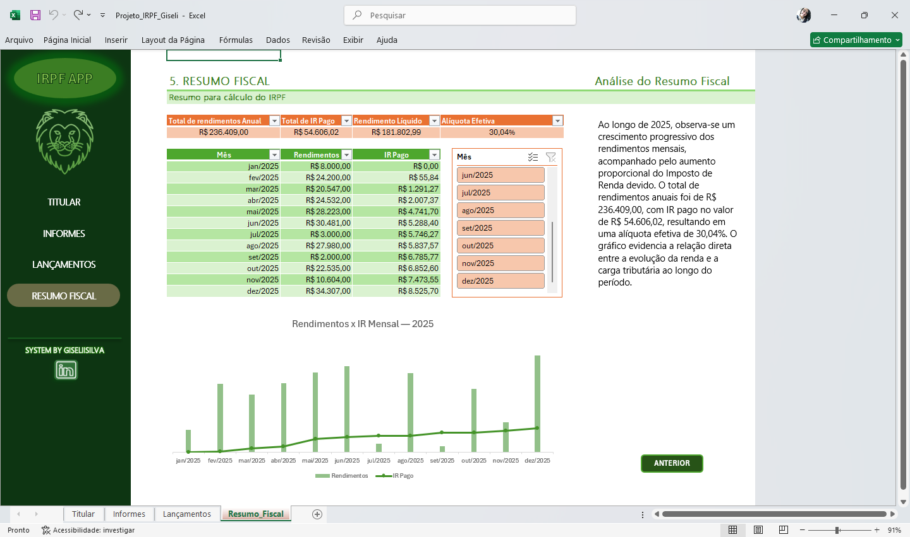
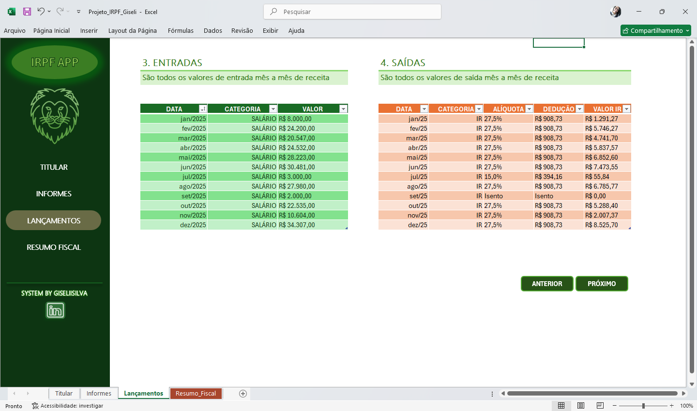

# 💰 Análise de IRPF em Excel — Resumo Fiscal

## 📌 Sobre o projeto

Desenvolvimento de uma solução em Excel para organização, cálculo e análise do Imposto de Renda Pessoa Física (IRPF).

O projeto estrutura rendimentos, aplica automaticamente as faixas de tributação e gera um resumo fiscal anual, permitindo uma visualização clara do impacto dos impostos sobre a renda.

---

## 🎯 Objetivo

* Organizar dados financeiros de forma estruturada
* Automatizar o cálculo do IRPF
* Aplicar corretamente as faixas de tributação
* Consolidar informações em um resumo anual
* Facilitar a análise por meio de visualizações

---

## 🧠 Principais funcionalidades

* Estruturação de dados em entradas e saídas
* Enquadramento automático de alíquota com **PROCX (XLOOKUP)**
* Consolidação mensal e anual com **SOMASES**
* Cálculo de indicadores financeiros:

  * Rendimentos totais
  * Imposto pago
  * Rendimento líquido
  * Alíquota efetiva
* Visualização com gráfico combinado (colunas + linha)
* Filtro dinâmico por período

---

## 🛠️ Ferramentas utilizadas

* Microsoft Excel
* PROCX (XLOOKUP)
* SOMASES
* Tabelas estruturadas
* Gráficos dinâmicos
* Formatação condicional

---

## 🗂️ Estrutura do projeto

* **Titular** → dados cadastrais
* **Informes** → informações complementares
* **Lançamentos** → base de dados
* **Tabela_IR** → faixas de tributação
* **Resumo_Fiscal** → consolidação e visualização
* **Lista** → apoio para validações

---

## 📈 Resultados e insights

* Visualização da evolução dos rendimentos ao longo do período
* Análise do impacto do IR conforme o aumento da renda
* Identificação da alíquota efetiva aplicada
* Organização clara das informações para tomada de decisão

---

## 🚀 Aprendizados

* Aplicação de lógica fiscal em Excel
* Uso de funções avançadas para automação de cálculos
* Estruturação de dados para análise financeira
* Desenvolvimento de relatórios claros e objetivos

---

## 📷 Visão geral

### 🧾 Lançamentos

### 📊 Resumo Fiscal

---

## 📌 Observação

Projeto com finalidade prática, aplicando conceitos de Excel voltados à organização financeira e análise de dados.

---

## 👩‍💻 Autora

**Giseli Silva**
Área Administrativa | Dados | Excel
